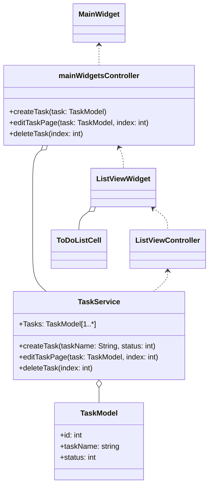

# Flutter 學習專案
## 專案目標
1. 建立一個簡單的todolist 工具。 

2. 使用 getX 輔助依賴注入以及觀察者的功能。 https://pub.dev/packages/get

## 架構

```mermaid
classDiagram
    MainWidget <.. mainWidgetsController
    mainWidgetsController o-- TaskService
    TaskService o-- TaskModel
    mainWidgetsController <.. ListViewWidget
    ListViewWidget o-- ToDoListCell
    ListViewWidget <.. ListViewController
    ListViewController <.. TaskService

    class MainWidget

    class mainWidgetsController {
        +createTask(task: TaskModel)
        +editTaskPage(task: TaskModel, index: int)
        +deleteTask(index: int)
    }

    class TaskService {
        +Tasks: TaskModel[1..*]
        +createTask(taskName: String, status: int)
        +editTaskPage(task: TaskModel, index: int)
        +deleteTask(index: int)
    }

    class TaskModel {
        +id: int
        +taskName: string
        +status: int
    }

    class ListViewWidget

    class ListViewController

    class ToDoListCell
```
根據規劃的架構，主要只有一個資料來源，TaskService。在TaskService 裡，具有C R U D 的功能提供給其他物件調用。
