# Flutter 學習專案

## 專案目標

1. 建立一個簡單的todolist 工具。 
2. getX https://pub.dev/packages/get
3. share preferences
4. sqflite
5. i18n

## 架構

```mermaid
classDiagram
    MainWidget <.. mainWidgetsController
    mainWidgetsController o-- TaskService
    TaskService o-- TaskModel
    mainWidgetsController <.. ListViewWidget
    ListViewWidget o-- ToDoListCell
    ListViewWidget <.. ListViewController
    ListViewController <.. TaskService
    TaskService <.. TaskProvider
    class MainWidget

    class mainWidgetsController {
        +createTask(task: TaskModel)
        +editTaskPage(task: TaskModel, index: int)
        +deleteTask(index: int)
    }

    class TaskService {
        +Tasks: TaskModel[1..*]
        +createTask(taskName: String, status: int)
        +editTaskPage(task: TaskModel, index: int)
        +deleteTask(index: int)
    }

    class TaskProvider {
        + initDatabase
        + insertTask
        + updateTask
        + deleteTask
        + getAllTasks
        + deleteAllTasks
    }

    class TaskModel {
        +id: int
        +taskName: string
        +status: int
    }

    class ListViewWidget

    class ListViewController

    class ToDoListCell
```



根據規劃的架構，主要只有一個資料來源，TaskService。在TaskService 裡，具有CRUD 的功能提供給其他物件調用。

# 技術使用
探索使用到的重點技術，這些工具的使用旨在於架構上的純潔。

## getX
 
#### Route management
 利用 get 製作 route 的功能，製作切換頁面的樹狀結構。
```dart
getPages: [
        GetPage(name: '/', page: () => HomePage(), binding: HomeBinding()),
        GetPage(name: '/edit', page: () => const EditPage(), binding: HomeBinding()),
      ],
```

#### Dependency management
利用 bind 的語法描述依賴關係。並且透過 GetView 的語法糖，讓程式碼簡潔(MVC)。
```dart
class HomeBinding extends Bindings {
  @override
  void dependencies() {
    Get.lazyPut<TaskService>(() => TaskService());
    Get.lazyPut<HomePageController>(() => HomePageController());
  }
}
```
這格語法讓 GetView 不用再描述 Controller 的 find 語法。
```dart
class HomePage extends GetView<HomePageController> {}
```
#### Utils
建立 TranslationService，與 get 綁定，提供簡易切換語系的功能。
```dart   
      return GetMaterialApp(
      translations: TranslationService(),
      locale: TranslationService.currentLanguageCode.locale,
      fallbackLocale: TranslationService.fallbackLocale.locale,
      initialRoute: '/',
      defaultTransition: Transition.fade,
      getPages: [
        GetPage(name: '/', page: () => const HomePage(), binding: HomeBinding()),
        GetPage(name: '/edit', page: () => const EditPage(), binding: EditBinding()),
      ],
    );
```
```dart
Text('title'.tr);
```
# SharedPreferences
儲存上次多國語系的設定。
```dart
static Future<void> init() async {
    SharedPreferences prefs = await SharedPreferences.getInstance();
    await loadLanguages();
    String? localeString = prefs.getString(prefsKey);
    if (localeString != null) {
      currentLanguageCode = getLanguageCodeBy(localeString);
    } else {
      try {
        currentLanguageCode = getLanguageCodeByLocate(Get.deviceLocale);
      } catch (e) {
        currentLanguageCode = fallbackLocale;
      }
      await prefs.setString(prefsKey, currentLanguageCode.key);
    }
    Get.updateLocale(currentLanguageCode.locale);
  }
```

# sqflite
建立TaskProvider。提供CRUD 的 interface 給 service 調用。
```dart
  Future<int> insertTask(Task task) async {
    if (database == null) {return 0;}
    return await database!.rawInsert(
      '''
      INSERT OR REPLACE INTO $tableName (id, name, status)
      VALUES (?, ?, ?)
      ''',
      [task.id, task.name, task.status.index],
    );
  }
```
使用了 rawInsert, rawUpdate, rawDelete, rawQuery, rawDelete 等語法建立。